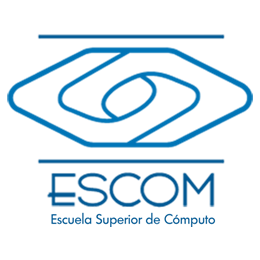

  

<h3 align="center">TT 2022-A033 Aplicación Android Pick Up para realizar pedidos en la barra de café ESCOM</h3>

---

    Rama dedicada a la programacion del sistema barra de cafe ESCOM
     

## ✍️ Integrantes 

- [Arce Gudiño Antonio](https://github.com/AntonioArce)
- [Escorcia Peña Jose Daniel]()

## ✍️ Tecnologias a Utilizar 

### React Native

  

### Node js Express

  

